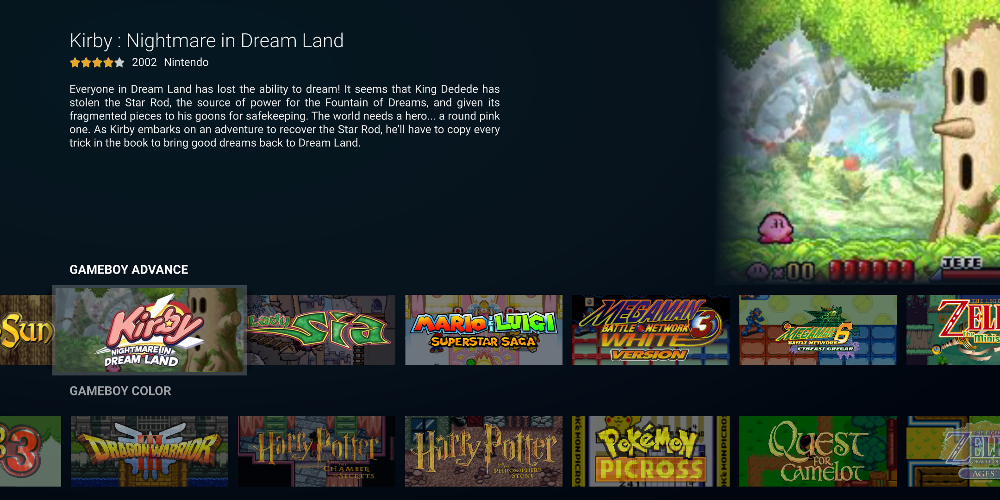

# RefiOS (a fork of Flixnet)

# RefiOS theme for Pegasus

IMPORTANT: This is a fork of [Flixnet](https://github.com/mmatyas/pegasus-theme-flixnet) by Mátyás Mustoha. A theme inspired by smart TVs and video streaming applications. RefiOS is a theme for [Pegasus Frontend](http://pegasus-frontend.org/).

## Installation

[Download](https://github.com/eleo95/pegasus-theme-refiOS/archive/master.zip) and extract the theme to your [theme directory](http://pegasus-frontend.org/docs/user-guide/installing-themes). You can then select it in the settings menu of Pegasus.

## License

